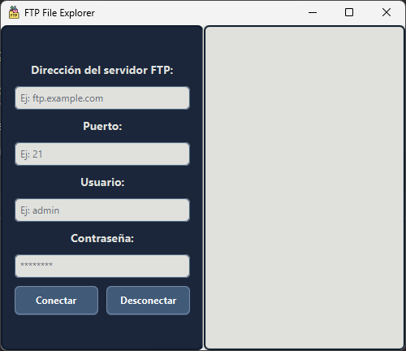

# Graphic FTP

## Manual de Instalación

### Desde un IDE
1. Clona el repositorio a tu máquina local:
    ```sh
    git clone https://github.com/Sinbelisk/graphic-ftp.git
    ```
2. Abre el proyecto en tu IDE favorito (por ejemplo, IntelliJ IDEA, Eclipse).
3. Navega a la clase `Main` en el paquete `src/main/java/org/sinbelisk/graphicftp/`.
4. Ejecuta la clase `Main`.

### Descargando las Releases
1. Descarga la última release desde [aquí](https://github.com/iesgrancapitan2425-din/tarea8-2-practica-final-trimestre-Sinbelisk/releases).
2. Descomprime el archivo descargado en tu ubicación preferida.
3. Ejecuta el archivo `.exe`:
    - En Windows, haz doble clic en el archivo `graphic-ftp.exe`.
4. Alternativamente, puedes ejecutar el archivo `.jar`:
    ```sh
    java -jar graphic-ftp-V1.0.jar
    ```

## Manual de Usuario
### Información general
La interfáz de la aplicación es la siguente:

- `Dirección`: se introduce la IP del servidor; ej: **localhost**
- `Puerto`: se introduce el puerto del servidor; ej: **21 (FTP)**
- `Usuario` **y Contraseña:** se introduce el usuario y contraseña.
- `Boton conectar`: recoge los parámetros introducidos e intenta iniciar sesión.
- `Boton desconectar`: comprueba si hay una sesión activa y desconecta al usuario del servidor

Si al pulsar el botón de conectar no hay parámetros válidos o no existe el usuario en servidor, mostrará un error. De lo contrario sincronizará el explorador de archivos de la aplicación con el servidor:

### Guía de Uso


## Manual de Programador

### Carpeta de Logs
La carpeta `logs` se encuentra en la raíz del proyecto y contiene logs generados mediante Log4J. En cada ejecución del programa, se genera un archivo de log con información relevante.  
Los logs tienen el siguente formato: ```{yyyy-MM-dd HH:mm:ss} [Hilo] Nivel/Gravedad clase-que-emite-el-log - mensaje```

### Estructura de la Aplicación
```plaintext
graphic-ftp/
├── src/
│   ├── main/
│   │   ├── java/
│   │   │   ├── org/
│   │   │   │   ├── sinbelisk/
│   │   │   │   │   ├── graphicftp/
│   │   │   │   │   │   ├── FTPClientManager.java
│   │   │   │   │   │   ├── FTPExplorerApp.java
│   │   │   │   │   │   ├── controller/
│   │   │   │   │   │   │   ├── FileExplorerController.java
│   │   │   │   │   │   │   ├── FTPFileExplorer.java
│   │   │   │   │   │   │   ├── FileTreeContextMenu.java
│   │   │   │   │   │   ├── util/
│   │   │   │   │   │   │   ├── FileChooserUtils.java
│   │   │   │   │   │   │   ├── ElementUtils.java
│   │   │   │   │   │   │   ├── AlertFactory.java
│   │   ├── resources/
│   │   │   ├── file_explorer.fxml
│   │   │   ├── log4j2.xml
│   │   │   ├── styles.css
│   ├── test/
│   │   ├── java/
│   │   │   ├── org/
│   │   │   │   ├── sinbelisk/
│   │   │   │   │   ├── graphicftp/
│   │   │   │   │   │   ├── controller/
│   │   │   │   │   │   │   ├── FTPFileExplorerTest.java
│   │   │   │   │   │   ├── services/
│   │   │   │   │   │   │   ├── FTPClientManagerTest.java
```

### Funcionamiento General de la Aplicación
La aplicación es un cliente gráfico de FTP que permite a los usuarios conectarse a servidores FTP, y subir o descargar archivos de manera intuitiva. Utiliza `log4j` para el manejo de logs y proporciona interfaces gráficas para la interacción del usuario.

### Clases de Tests
Las clases de tests se encuentran en `src/test/java/org/sinbelisk/graphicftp/`. Puedes ejecutar estos tests utilizando tu IDE o herramientas de línea de comandos como `maven` o `gradle`. Asegúrate de modificar las variables globales en los archivos de configuración de los tests según sea necesario.
