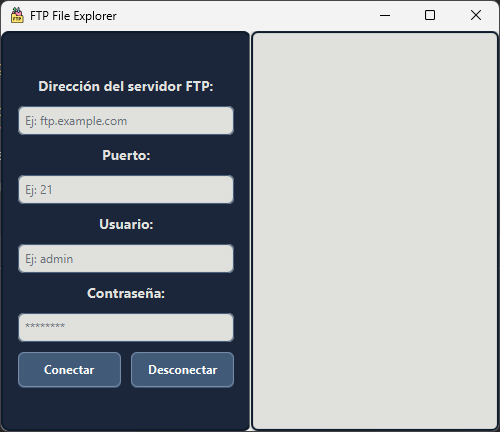
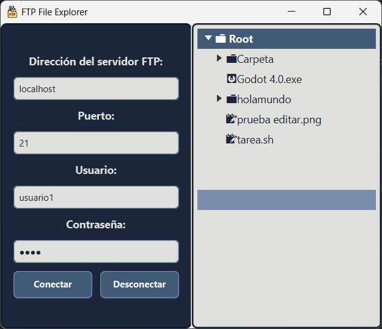

# Graphic FTP

## 📥 Instalación y ejecución

### Desde un IDE
1. Clona el repositorio en tu máquina local:
    ```sh
    git clone https://github.com/Sinbelisk/graphic-ftp.git
    ```
2. Abre el proyecto en tu IDE favorito (IntelliJ IDEA, Eclipse, etc.).
3. Navega a la clase `Main` en `src/main/java/org/sinbelisk/graphicftp/`.
4. Ejecuta la clase `Main`.

### Descargando una Release
1. Descarga la última versión desde [GitHub Releases](https://github.com/iesgrancapitan2425-din/tarea8-2-practica-final-trimestre-Sinbelisk/releases).
2. Descomprime el archivo en tu ubicación preferida.
3. Ejecuta el archivo:
    - **Windows**: Doble clic en `graphic-ftp.exe`.
    - **Alternativa**: Ejecuta el `.jar` manualmente:
      ```sh
      java -jar graphic-ftp-V1.0.jar
      ```

---

## 🖥️ Manual de Usuario

### Interfaz Principal



- **Dirección**: Introduce la IP del servidor, por ejemplo, `localhost`.
- **Puerto**: Introduce el puerto del servidor, por defecto `21` para FTP.
- **Usuario y Contraseña**: Credenciales de acceso al servidor.
- **Botón "Conectar"**: Intenta iniciar sesión con los datos proporcionados.
- **Botón "Desconectar"**: Cierra la sesión activa en el servidor.

Si los datos son incorrectos o el usuario no existe, se mostrará un error. Al conectarse correctamente, la aplicación sincroniza el explorador de archivos con el servidor:



El sistema carga y muestra las carpetas y archivos disponibles en el servidor de forma inteligente. Las carpetas son sincronizadas una vez abiertas para evitar sobrecargar el servidor de peticiones.

### 📂 Operaciones Disponibles

Haciendo clic derecho sobre un archivo o carpeta, se despliega un menú con las siguientes opciones:

- **Crear carpeta**: Crea un nuevo directorio en la ubicación seleccionada.
- **Renombrar**: Modifica el nombre de un archivo o carpeta.
- **Eliminar**: Borra el elemento seleccionado.
- **Descargar**: Guarda el archivo en una ubicación de tu equipo.
- **Subir**: Permite seleccionar un archivo y subirlo al servidor.


### Consideraciones de Uso
- Solo se pueden crear carpetas y subir archivos dentro de directorios, si se intenta desde un fichero se creará automáticamente en su carpeta padre.
- Todas las acciones se realizan desde el menú contextual (clic derecho).
- En caso de error, se mostrará una alerta visual.
- Se proporcionan mensajes de retroalimentación al subir o descargar archivos.
- Al desconectarse, se solicita confirmación para evitar cierres accidentales.

### ⚠️ Posibles Errores
- La aplicación ha sido probada con **FileZilla Server**, por lo que otros servidores pueden presentar incompatibilidades.
- No se ha probado con servidores externos (fuera de la red local).
- En ocasiones, la sincronización inicial del explorador de archivos puede fallar, mostrando la carpeta "`Root`" vacía. En ese caso, reconéctate al servidor.


---

## 👨‍💻 Manual de Programador
### ⚙️ Tecnologías utilizadas
- **Java 17**
- **Launch4J**: para la creación de un archivo ejecutable
#### Librerias y frameworks
- **JavaFX**: interfáz gráfica.
- **Log4J**: para la generación de logs en un archivo.
- **Apache commons:** para la conexión a un servidor
- **JUnit**: pruebas unitarias.

### 📂 Carpeta de Logs

Los logs se almacenan en la carpeta `logs` en la raíz del proyecto y se generan con **Log4J**. Cada ejecución del programa crea un nuevo archivo de log con información relevante.

Formato del log:
```sh
{yyyy-MM-dd HH:mm:ss} [Hilo] Nivel/Gravedad Clase-que-emite-el-log - Mensaje
```
Si no existe la carpeta, se creará automáticamente al iniciar el programa.

### 📁 Estructura del Proyecto
```bash
graphic-ftp/
├── src/
│   ├── main/
│   │   ├── java/
│   │   │   ├── org/
│   │   │   │   ├── sinbelisk/
│   │   │   │   │   ├── graphicftp/
│   │   │   │   │   │   ├── FTPExplorerApp.java   # Clase principal de la aplicación
│   │   │   │   │   │   ├── Main.java             # Clase que contiene el método main
│   │   │   │   │   │   │
│   │   │   │   │   │   ├── services/             # Paquete con los servicios utilizados
│   │   │   │   │   │   │   ├── FTPClientManager  # Gestiona la conexión al servidor FTP y sus operaciones
│   │   │   │   │   │   │
│   │   │   │   │   │   ├── controller/           # Controladores y lógica de la aplicación
│   │   │   │   │   │   │   ├── FileExplorerController.java  # Controlador principal de la aplicación
│   │   │   │   │   │   │   ├── FTPFileExplorer.java         # Maneja la exploración de archivos mediante FTPClientManager
│   │   │   │   │   │   │   ├── FileTreeContextMenu.java     # Gestiona el menú contextual para acciones sobre archivos
│   │   │   │   │   │   │
│   │   │   │   │   │   ├── util/                 # Clases de utilidad
│   │   │   │   │   │   │   ├── FileChooserUtils.java  # Utilidad para seleccionar archivos
│   │   │   │   │   │   │   ├── ElementUtils.java      # Métodos auxiliares para manipular elementos de un TreeView
│   │   │   │   │   │   │   ├── AlertFactory.java      # Generador de alertas para la interfaz gráfica
│   │   │   │   │   │
│   │   ├── resources/               # Recursos de la aplicación
│   │   │   ├── file_explorer.fxml    # Diseño de la interfaz en FXML
│   │   │   ├── log4j2.xml            # Configuración de logging
│   │   │   ├── styles.css            # Estilos de la interfaz gráfica
│   │
│   ├── test/                         # Paquete de pruebas unitarias
│   │   ├── java/
│   │   │   ├── org/
│   │   │   │   ├── sinbelisk/
│   │   │   │   │   ├── graphicftp/
│   │   │   │   │   │   ├── controller/
│   │   │   │   │   │   │   ├── FTPFileExplorerTest.java  # Pruebas unitarias del explorador de archivos FTP
│   │   │   │   │   │   │
│   │   │   │   │   │   ├── services/
│   │   │   │   │   │   │   ├── FTPClientManagerTest.java # Pruebas unitarias para la gestión de conexión FTP

```

### 🧪 Tests

Las pruebas unitarias están ubicadas en:
```
src/test/java/org/sinbelisk/graphicftp/
```
Para ejecutar los tests:
- Utiliza el IDE (IntelliJ, Eclipse, etc.).
- Usa herramientas como **Maven** o **Gradle**.
- Modifica las variables de configuración de los tests según sea necesario.

### 📝 Funcionamiento Relevante

Este apartado explica el funcionamiento de los algoritmos más relevantes implementados en la aplicación.  
Para más información, revisa las clases resaltadas. Todas las clases han sido documentadas utilizando `javadoc`.

---

#### 🔄 Sincronización Servidor-Explorador

La clase `FTPFileExplorer.java` utiliza el servicio `FTPClientManager.java` para gestionar la conexión al servidor FTP.  
A través de este servicio, se obtiene la lista de archivos y carpetas disponibles para el usuario autenticado y se sincroniza con el `TreeView` del explorador de archivos.

📌 **Proceso de sincronización:**
1. La sincronización se realiza en un hilo separado utilizando [Tasks](https://docs.oracle.com/javafx/2/api/javafx/concurrent/Task.html) de **JavaFX**.
2. A medida que la **Task activa** recibe datos del servidor, se actualiza dinámicamente el `TreeView` con la información obtenida.
3. Esto garantiza que la interfaz gráfica no se bloquee mientras se realiza la sincronización.

---

#### ⏳ Lazy Loading

El algoritmo de sincronización en `FTPFileExplorer.java` implementa **Lazy Loading** para optimizar el rendimiento.

📌 **Principios del Lazy Loading en la aplicación:**
- **Carga diferida:** Solo se sincroniza la carpeta raíz del usuario al establecer la conexión.
- **Petición bajo demanda:** Se realiza una consulta al servidor **únicamente cuando el usuario expande una carpeta** en el explorador.
- **Eficiencia:** Se evita sobrecargar tanto el servidor con peticiones innecesarias como el dispositivo del usuario con datos no requeridos.

Este enfoque mejora la escalabilidad y la experiencia del usuario, asegurando una carga rápida y fluida de los archivos.

---

#### ⚙️ Algoritmos y Funcionalidades Clave

1. **Gestión de Conexión FTP**:
    - La clase `FTPClientManager.java` es responsable de gestionar todas las operaciones relacionadas con el servidor FTP, como conectar, desconectar, y ejecutar comandos FTP.
    - Implementa métodos para subir, descargar, renombrar y eliminar archivos y carpetas en el servidor FTP.

2. **Exploración de Archivos**:
    - `FTPFileExplorer.java` maneja la exploración de archivos y carpetas en el servidor FTP.
   
3. **Menú Contextual**:
    - La clase `FileTreeContextMenu.java` gestiona el menú contextual que permite a los usuarios realizar acciones como crear, renombrar, eliminar, subir y descargar archivos y carpetas.
    - Utiliza **eventos JavaFX** para ejecutar las acciones correspondientes cuando el usuario interactúa con el menú.

4. **Utilidades**:
    - `FileChooserUtils.java` facilita la selección de archivos y directorios en el sistema local del usuario.
    - `ElementUtils.java` contiene métodos auxiliares para manipular elementos del `TreeView`.
    - `AlertFactory.java` genera alertas y mensajes de retroalimentación en la interfaz gráfica para mejorar la experiencia del usuario.

---
