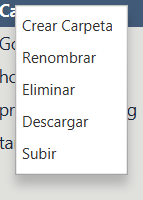

# Graphic FTP

## 📥 Instalación y ejecución

### Desde un IDE
1. Clona el repositorio en tu máquina local:
    ```sh
    git clone https://github.com/Sinbelisk/graphic-ftp.git
    ```
2. Abre el proyecto en tu IDE favorito (IntelliJ IDEA, Eclipse, etc.).
3. Navega a la clase `Main` en `src/main/java/org/sinbelisk/graphicftp/`.
4. Ejecuta la clase `Main`.

### Descargando una Release
1. Descarga la última versión desde [GitHub Releases](https://github.com/iesgrancapitan2425-din/tarea8-2-practica-final-trimestre-Sinbelisk/releases).
2. Descomprime el archivo en tu ubicación preferida.
3. Ejecuta el archivo:
   - **Windows**: Doble clic en `graphic-ftp.exe`.
   - **Alternativa**: Ejecuta el `.jar` manualmente:
     ```sh
     java -jar graphic-ftp-V1.0.jar
     ```

---

## 🖥️ Manual de Usuario

### Interfaz Principal


- **Dirección**: Introduce la IP del servidor, por ejemplo, `localhost`.
- **Puerto**: Introduce el puerto del servidor, por defecto `21` para FTP.
- **Usuario y Contraseña**: Credenciales de acceso al servidor.
- **Botón "Conectar"**: Intenta iniciar sesión con los datos proporcionados.
- **Botón "Desconectar"**: Cierra la sesión activa en el servidor.

Si los datos son incorrectos o el usuario no existe, se mostrará un error. Al conectarse correctamente, la aplicación sincroniza el explorador de archivos con el servidor:


El sistema carga y muestra las carpetas y archivos disponibles en el servidor de forma inteligente. Las carpetas son sincronizadas una vez abiertas para evitar sobrecargar el servidor de peticiones.

### 📂 Operaciones Disponibles

Haciendo clic derecho sobre un archivo o carpeta, se despliega un menú con las siguientes opciones:

- **Crear carpeta**: Crea un nuevo directorio en la ubicación seleccionada.
- **Renombrar**: Modifica el nombre de un archivo o carpeta.
- **Eliminar**: Borra el elemento seleccionado.
- **Descargar**: Guarda el archivo en una ubicación de tu equipo.
- **Subir**: Permite seleccionar un archivo y subirlo al servidor.



### Consideraciones de Uso
- Solo se pueden crear carpetas y subir archivos dentro de directorios, si se intenta desde un fichero se creará automaticamente en su carpeta padre.
- Todas las acciones se realizan desde el menú contextual (clic derecho).
- En caso de error, se mostrará una alerta visual.
- Se proporcionan mensajes de retroalimentación al subir o descargar archivos.
- Al desconectarse, se solicita confirmación para evitar cierres accidentales.

### ⚠️ Posibles Errores
- La aplicación ha sido probada con **FileZilla Server**, por lo que otros servidores pueden presentar incompatibilidades.
- No se ha probado con servidores externos (fuera de la red local).
- En ocasiones, la sincronización inicial del explorador de archivos puede fallar, mostrando la carpeta "Root" vacía. En ese caso, reconéctate al servidor.


---

## 👨‍💻 Manual de Programador

### 📂 Carpeta de Logs

Los logs se almacenan en la carpeta `logs` en la raíz del proyecto y se generan con **Log4J**. Cada ejecución del programa crea un nuevo archivo de log con información relevante.

Formato del log:
```sh
{yyyy-MM-dd HH:mm:ss} [Hilo] Nivel/Gravedad Clase-que-emite-el-log - Mensaje
```

### 📁 Estructura del Proyecto
```plaintext
graphic-ftp/
├── src/
│   ├── main/
│   │   ├── java/
│   │   │   ├── org/
│   │   │   │   ├── sinbelisk/
│   │   │   │   │   ├── graphicftp/
│   │   │   │   │   │   ├── FTPClientManager.java
│   │   │   │   │   │   ├── FTPExplorerApp.java
│   │   │   │   │   │   ├── controller/
│   │   │   │   │   │   │   ├── FileExplorerController.java
│   │   │   │   │   │   │   ├── FTPFileExplorer.java
│   │   │   │   │   │   │   ├── FileTreeContextMenu.java
│   │   │   │   │   │   ├── util/
│   │   │   │   │   │   │   ├── FileChooserUtils.java
│   │   │   │   │   │   │   ├── ElementUtils.java
│   │   │   │   │   │   │   ├── AlertFactory.java
│   │   ├── resources/
│   │   │   ├── file_explorer.fxml
│   │   │   ├── log4j2.xml
│   │   │   ├── styles.css
│   ├── test/
│   │   ├── java/
│   │   │   ├── org/
│   │   │   │   ├── sinbelisk/
│   │   │   │   │   ├── graphicftp/
│   │   │   │   │   │   ├── controller/
│   │   │   │   │   │   │   ├── FTPFileExplorerTest.java
│   │   │   │   │   │   ├── services/
│   │   │   │   │   │   │   ├── FTPClientManagerTest.java
```

### ⚙️ Funcionamiento General

**Graphic FTP** es un cliente FTP con interfaz gráfica que permite a los usuarios conectarse a servidores FTP y gestionar archivos de forma sencilla. Utiliza **Log4J** para el manejo de logs y proporciona una interfaz intuitiva para facilitar la interacción del usuario.

### 🧪 Tests

Las pruebas unitarias están ubicadas en:
```
src/test/java/org/sinbelisk/graphicftp/
```
Para ejecutar los tests:
- Utiliza el IDE (IntelliJ, Eclipse, etc.).
- Usa herramientas como **Maven** o **Gradle**.
- Modifica las variables de configuración de los tests según sea necesario.

